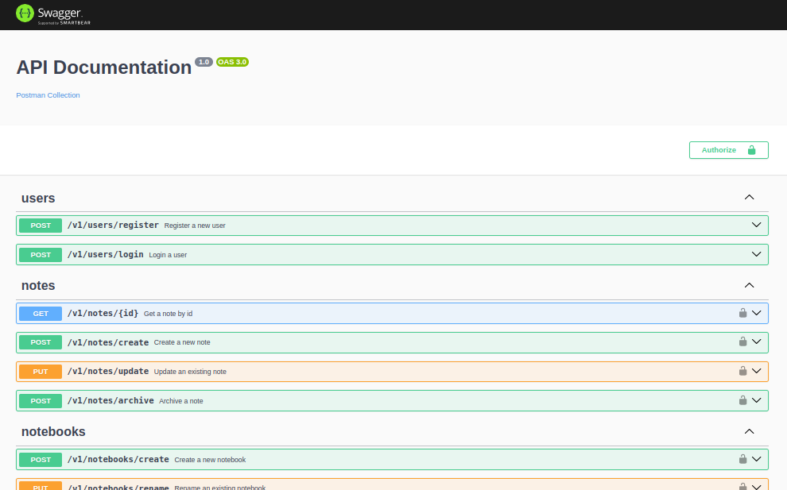

# Notes Management 📝

### Domain: Notes  

#### Description  

**Definition**:  
A domain is a sphere of knowledge, influence, or activity. It represents the subject area to which the user applies the program. In the context of this project, the domain focuses on **Notes Management**, inspired by personal productivity and knowledge organization systems.  

---

#### Notes Management  

The core business entities are **User**, **Note**, and **Notebook**. The following outlines the primary domain rules and relationships:  

- **Users**:  
  - A User can create multiple Notebooks and Notes.  
  - Each User has a unique identity and manages their own content.  

- **Notebooks**:  
  - Notebooks are containers for organizing Notes.  
  - A Notebook can contain multiple Notes.  

- **Notes**:  
  - A Note is the smallest unit of the system, representing a single piece of information.  
  - Notes can have metadata such as **title**, **content**, **tags**, **created date**, and **last modified date**.  
  - Notes can belong to one or more Notebooks.  
  - Users can archive Notes, marking them as inactive but not deleted.  

- **Tagging**:  
  - Notes can be tagged for better organization and retrieval.  
  - Tags are unique per User and can be reused across Notes.  


#### Additional Features  

- **Search**:  
  - Users can search Notes by title, content, tags, or metadata.  


#### Users  

- **Permissions**:  
  - Each User is only can manage notes created by herself.

- **Registration and Authentication**:  
  - User registration requires email.  
  - Authentication is managed through secure tokens (e.g., JWT).
 

# Tactical


### Architectural Overview

#### Architectural Styles

- Architectural Pattern: Hexagonal (Ports and Adapters) Architecture
- Design Approach: Domain-Driven Design (DDD)
- Structural Pattern: Modular Monolith
  


## Caching Strategy
The project implements Redis caching using the Aside strategy for note retrieval

## Testing Approach

### Unit tests for domain logic:
Unit testing domain logic ensures that the core business rules and behaviors of our Notes Management system are correct, reliable, and maintain their intended functionality.

## Continuous Integration with GitHub Actions


Automated workflows managed through GitHub Actions:
- Build verification
- Lint checks
- Unit testing
- Code quality enforcement

This project uses GitHub Actions to automate continuous integration tasks, including building the application, running lint checks, and executing unit tests. The workflow ensures code quality and stability with every commit and pull request. refer to the [Continuous Integration Guidelines](./docs/continuous-integration.md).


## Git Workflow


For detailed guidelines on our Git workflow, including branching strategies and pull request conventions, refer to the [Git Workflow Guidelines](./docs/development-process-and-branching-strategy.md).

## HTTP API Documentation
Swagger UI

The project uses Swagger for API documentation and interactive API testing.



Accessing Swagger Documentation:

- Local Development: http://localhost:port/docs
- Swagger JSON: http://localhost:port/docs-json

## Running the Project
Local Development

Install dependencies:

```bash
npm install
```

Set up environment variables:

```bash
cp .env.example to .env
```

Run the application:

```bash
# Development mode
npm run start:dev

# Production mode
npm run start:prod
```

## Docker Compose Deployment

```bash
# Development
docker compose up --build
```
